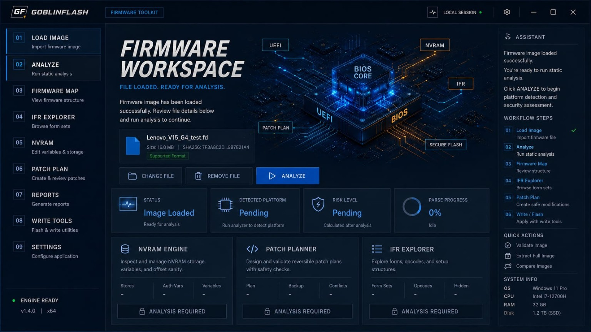

# GoblinFlash

**Active development · Proprietary · Public showcase**

GoblinFlash is an actively developed firmware analysis project focused on UEFI/BIOS inspection, traceable evidence, deterministic validation, and safe review workflows.

The project is designed as a firmware-analysis workstation for owner-authorized systems. Its emphasis is not on blind modification, but on making firmware structure understandable, reviewable, and evidence-backed before any consequential action is considered.

## Firmware Workspace

The Firmware Workspace is the central review surface: a place to inspect firmware-derived information, correlate findings, preserve evidence, and reason about changes before anything is acted upon.

## What GoblinFlash is built around

GoblinFlash is being developed around several recurring principles:

- structured UEFI/BIOS inspection;
- deterministic parsing and validation;
- traceable evidence and provenance;
- explicit separation between observation, interpretation, and proposed action;
- reviewable patch planning rather than opaque modification;
- conservative handling of uncertain or unsupported firmware structures;
- reproducible diagnostics and regression testing;
- clear safety boundaries for high-risk firmware operations.

The project has evolved through repeated parser, schema, validation, emulator, evidence, and workflow experiments. New functionality is expected to survive direct testing against real firmware structures rather than being accepted only because it works on synthetic examples.

## Project direction

The broader goal is to make low-level firmware analysis easier to reason about without reducing the process to a collection of unsafe one-click operations.

GoblinFlash is intended to support workflows such as:

- firmware structure inspection;
- configuration and capability discovery;
- evidence-oriented comparison of firmware states;
- parser and schema validation;
- review of candidate modifications before execution;
- recovery-oriented analysis;
- structured reporting for later verification.

The project deliberately avoids positioning itself as a tool for bypassing platform protections or as an “unlock any BIOS” utility.

## Development approach

The project follows an evidence-first development process.

Changes are expected to leave durable evidence describing:

- what was changed;
- how it was tested;
- which firmware or fixture was used;
- what the parser or validator observed;
- whether the result reproduced;
- what remains uncertain.

Negative results and failed approaches are preserved when they provide useful technical evidence.

## Current state

GoblinFlash is under active development.

The current work includes continued hardening of firmware parsing, validation, schema governance, evidence handling, and the Firmware Workspace. Public material is intended to show the direction, engineering approach, and selected project capabilities without publishing the complete implementation.

See [Project Status](docs/PROJECT_STATUS.md) for the current public status summary.

## Safety and scope

GoblinFlash is intended for analysis of firmware on systems where the operator is authorized to perform that work.

The project distinguishes between:

- discovering that a setting, structure, or capability exists;
- determining whether it can be changed safely;
- bypassing a protection mechanism.

Those are not treated as equivalent.

Potentially destructive write paths, platform security boundaries, hardware protections, and vendor-specific mechanisms require separate validation and authorization. The public showcase should not be interpreted as a promise that every visible firmware property is writable or safely modifiable.

## Documentation

- [Safety Boundaries](docs/SAFETY_BOUNDARIES.md)
- [Firmware Evidence Review](docs/FIRMWARE_EVIDENCE_REVIEW.md)
- [No Slop SDLC](docs/NO_SLOP_SDLC.md)
- [AI Reviewer Source Scope](docs/AI_REVIEWER_SOURCE_SCOPE.md)
- [Schema Governance Summary](docs/SCHEMA_GOVERNANCE_SUMMARY.md)
- [Project Status](docs/PROJECT_STATUS.md)
- [Non-Goals](docs/NON_GOALS.md)

## Public repository scope

This repository is a public project showcase and documentation surface.

It does **not** contain the complete GoblinFlash source code and is not intended to distribute the production implementation.

The public material may include selected documentation, screenshots, architecture summaries, status notes, and other non-sensitive project information.

## Contribution boundary

Public-safe documentation improvements are welcome.

See [CONTRIBUTING.md](CONTRIBUTING.md) before opening a pull request.

## Licensing

Unless explicitly stated otherwise, **GoblinFlash and its associated materials are proprietary. All rights reserved.**

GoblinFlash is **not open source** and **not freeware**.

No license to use, modify, redistribute, reverse engineer, or commercially exploit the unpublished GoblinFlash implementation is granted by the presence of this public repository.

Third-party names, firmware formats, trademarks, and referenced technologies remain the property of their respective owners.